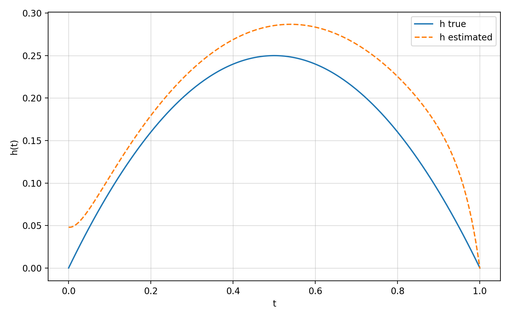
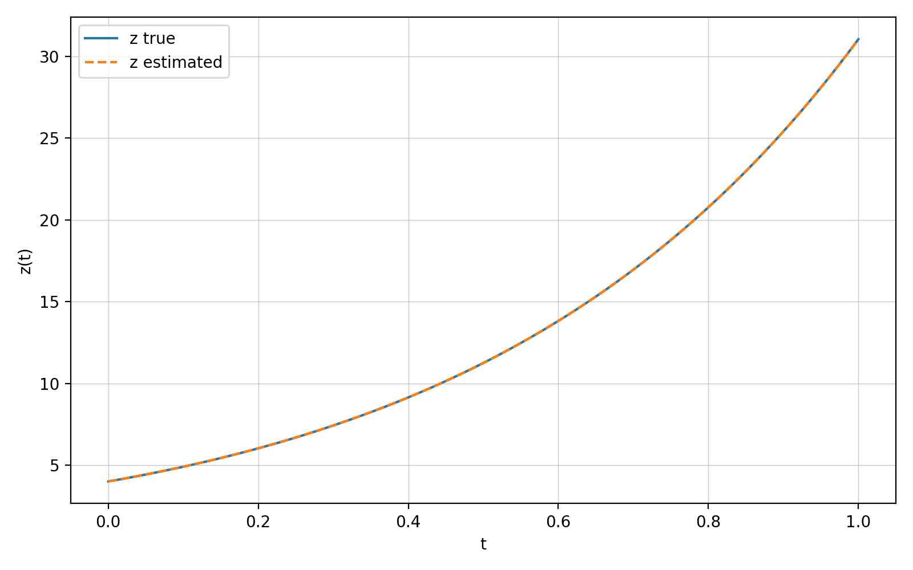
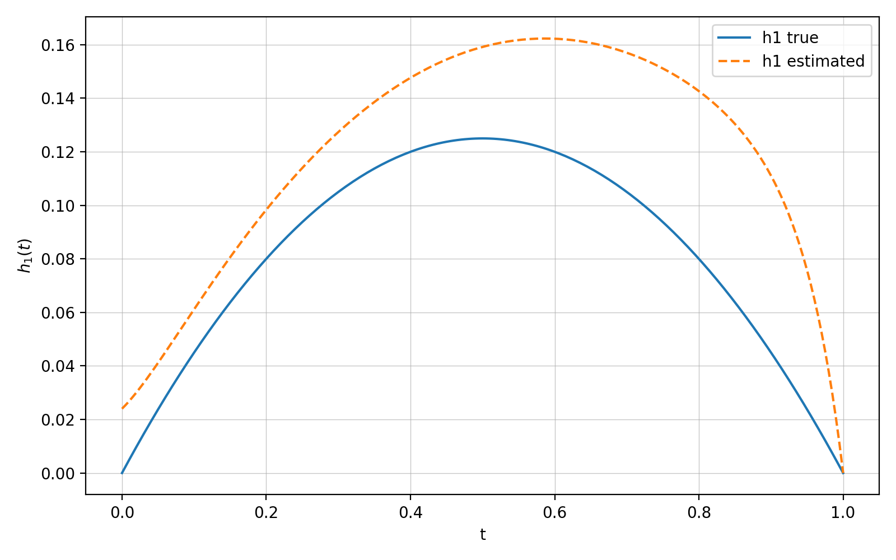
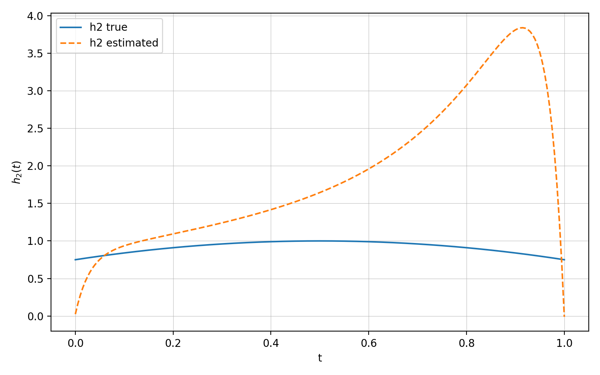
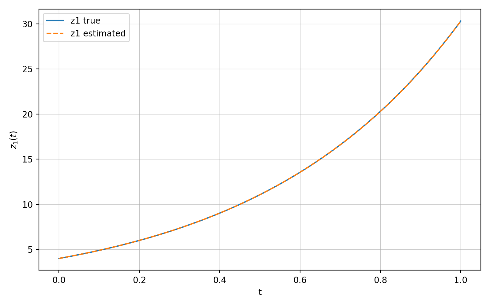
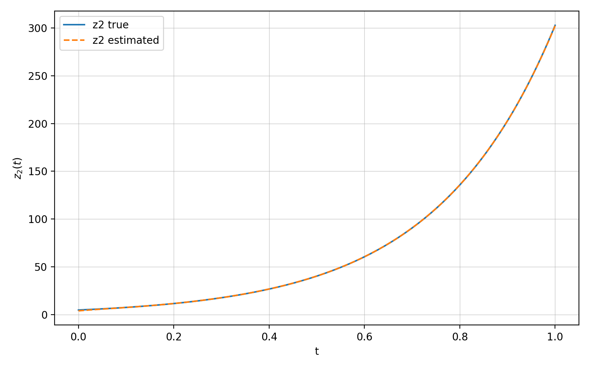

## Resolution of a problem of irrigation water estimation using the shooting method, in dimensions $n=1$ et $n=2$

**But.** 

For given $A\in\mathcal{M}_n(\mathbb{R})$, $G_2\in\mathcal{M}_n(\mathbb{R})$, $C\in\mathcal{M}_n(\mathbb{R})$, and $q_1,q_2>0$ considered ponderation weights, we want to construct the optimal pair
```math
\begin{aligned}
h^\star(t) &= -\tfrac{1}{q_2} G_2^\top p(t),\\
z(0) &= -\tfrac{1}{q_1} p(0)
\end{aligned}
```
where $(z,p)$ is solution of the optimality system  given by the TPBVP:
```math
\begin{aligned}
z'(t) &= A z(t) + G_2 h^\star(t) = A z(t) - \tfrac{1}{q_2} G_2 G_2^\top p(t), \quad z(0) = -\tfrac{1}{q_1} s,\\
p'(t) &= -A^\top p(t) - C^\top\!\big(C z(t) - y^{\mathrm m}(t)\big), \quad p(T)=0,
\end{aligned}
```
and $s := p(0)\in\mathbb{R}^n$ is **the shoot unknown**. 

---

### Implementation scheme (pseudo-code)
1. Give input data 
    - System: A, $G_2$, C
    - Objective: z0, h as known
    - Time discretization: T, N
    - Regulation: q1, q2
2. Forward z_true and y_m from known z0 and h
    - Integrate $z'(t) = A z(t) + G_2 h(t)$ using RK4 over grid t
    - Then compute $y(t) = C z(t)$
3. Backward p and $z_{est}$ from y_m with shooting method on p(0)
    - Define a function that integrate $(z'(t), p'(t))$ with $z(0) = -s/q1$, $p(T) = 0$ under the shoot $s=p(0)$.
    - Define the shooting function $F(s) := p(T; s)$ and find the good $s^\star$ such that $F(s^\star)=0$ by multiple integrations with $s$.
    - Integrate final (z, p) with the good $s^\star$.
4. Reconstruction of the irrigation $h_{est}$
    - $h(t) = -(1/q2) * G_2^T p(t)$
    - $z(0) = -(1/q1) * p(0)$
5. Make plots and metrics
    - Metrics: 
        - $Z0Error = z_0 - z_{0est}$
        - $RMSE_z = \sqrt{mean((z_{true} - z_{est})^2)}$
        - $RMSE_h = \sqrt{mean((z_{true} - z_{est})^2)}$
        - $YMisfit = \int_0^T \|Cz(t)-y^m(t)\|^2 dt$
        - $z_0Energy = \|z_0\|$
        - $HEnergy = \int_0^T \|h(t)\|^2 dt$
        - $z_0HEnergy = z_0Energy^2 + HEnergy$
    - Plots:
        - $z_{true}$ vs $z_{est}$
        - $h_{true}$ vs $h_{est}$
        - $z_{est}$ as function of q1 and/or q2
        - $h_{est}$ as function of q1 and/or q2
        - $z0Error$ as function of q1 and/or q2
        - $RMSE_z$ as function of q1 and/or q2
        - $RMSE_h$ as function of q1 and/or q2
        - $YMisfit$ as function of q1 and/or q2
        - $z_0Energy$ as function of q1 and/or q2
        - $HEnergy$ as function of q1 and/or q2
        - $z_0HEnergy$ as function of q1 and/or q2

---

### Input example
*With $n=1$:*
- System: $A=2, G_2=3, C=4.9$
- Objective: $z_{0true}=4, h_{\mathrm{true}}(t)=t(1 - t)$
- Time discretization: $T=1, N=200$
- Regulation: $q_1=0.001, q_2=3.5$

*With $n=2$:*
- System: System: $A = \begin{bmatrix}-0.06 & 0.01 \\[3pt] 0.01  & -0.06 \end{bmatrix},\;G_2 = \begin{bmatrix}0.1 & 0 \\ 0 & 0.1\end{bmatrix}$ and $C = \begin{bmatrix}1 & 0 \\ 0 & 1\end{bmatrix}$
- Objective: $z_{0true} = \begin{bmatrix}0.4 \\ 0.7\end{bmatrix}$, $h_{\mathrm{true}}(t) = \begin{bmatrix}t(1-t) \\ 0.5\,t(1-t)\end{bmatrix}$
- Time discretization: $T=1, N=200$
- Regulation: $q_1=10^{-5}, q_2=10^{-5}$

---

### Ouput example
**Metrics**
*With $n=1$:* <br>
z0 true = 4, z0 estimated = 4.040606328767682, error = 0.04060632876768189<br>
RMSE_z    = 0.03310815573827195<br>
RMSE_h    = 0.010816453903076895<br>
YMisfit   = 0.026098809107473274<br>
z0Energy  = 4.040606328767682<br>
hEnergy   = 0.0326768584236353<br>
z0HEnergy = 16.359176362501078

*With $n=2$:* <br>
z0 true = [0.4 0.7], z0 estimated = [0.39997393 0.69982875], z0 error = 0.00017322682302418966<br>
RMSE_z    = 4.7125821331296974e-05<br>
RMSE_h    = 0.00826870734086433<br>
YMisfit   = 4.3127306750436686e-09<br>
z0Energy  = 0.806064151243763<br>
HEnergy   = 0.04102883167179921<br>
z0HEnergy = 0.6857054886574083

**Plots**

*With $n=1$:* <br>
- $h_{true}$ vs $h_{estimated}$ 
- $z_{true}$ vs $z_{estimated}$ 

*With $n=2$:* <br>
- $h1_{true}$ vs $h1_{estimated}$ and $h2_{true}$ vs $h2_{estimated}$  
 
- $z1_{true}$ vs $z1_{estimated}$ and $z2_{true}$ vs $z2_{estimated}$  
 

---

### Files use
The files [simulation_n1.ipynb](simulation_n1.ipynb) and [simulation_n2.ipynb](simulation_n2.ipynb) are Jupyter notebooks that allow step-by-step execution of the script with direct display of the results, while the files [simulation_n1.py](simulation_n1.py) and [simulation_n2.py](simulation_n2.py) allow one-shot execution with final display of the results in the console. The generated figures are saved in the subfolder \verb|figs| in both execution modes. We note that the two-dimensional case can easily be extended to $n>2$.

---
